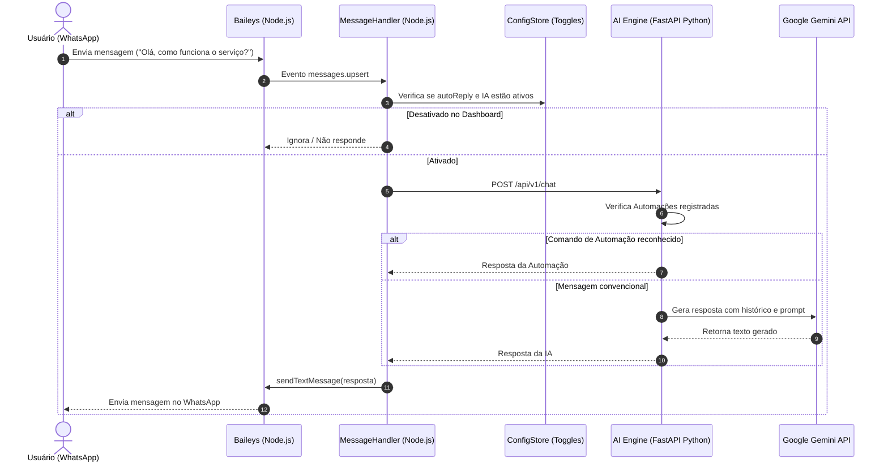

# Arquitetura do Sistema

## Visão Geral

Este projeto é estruturado em uma arquitetura de microsserviços desacoplados, divididos por responsabilidade de execução:

1. **WhatsApp Gateway & Web Dashboard (`services/whatsapp-gateway`)**:
   - **Linguagem**: Node.js (JavaScript ES Modules)
   - **Biblioteca WhatsApp**: `@whiskeysockets/baileys`
   - **Servidor Web**: Express.js com WebSockets (`ws`)
   - **Dashboard**: Interface SPA nativa (HTML5 / CSS3 / Vanilla JS)
   - **Função**:
     - Conectar ao WhatsApp Web sem precisar de navegador Chromium ou emulação pesada.
     - Capturar mensagens e despachar para o serviço de IA.
     - Fornecer API REST e WebSockets para o Dashboard de controle.
     - Permitir ligar/desligar respostas e integrações em tempo real sem reiniciar o bot.

2. **AI & Automation Engine (`services/ai-engine`)**:
   - **Linguagem**: Python 3.10+
   - **Framework Web**: FastAPI + Uvicorn
   - **Provedor de IA**: Google GenAI (`google-genai` SDK)
   - **Camada de Automação**: `AutomationRegistry` e `BaseAutomation`
   - **Memória de Conversa**: `ConversationStore` com TTL e histórico multi-turnos
   - **Função**:
     - Processar a linguagem natural das mensagens recebidas.
     - Executar regras e plugins de automação (ex: `!status`, agendamentos, busca).
     - Manter o histórico de contexto do usuário.
     - Isolar dependências pesadas de IA e ciência de dados do WhatsApp.

3. **Dashboard de Controlo**:
   - Controle em tempo real do status de conexão do WhatsApp e geração de QR Code.
   - Alternadores (toggles) para ligar/desligar:
     - Respostas automáticas gerais
     - Motor de IA
     - Resposta em grupos vs conversas privadas
     - Exigência de prefixo de comando
     - Módulos e APIs adicionais
   - Personalização de `system prompt` e escolha do modelo Gemini (`gemini-2.5-flash`, `gemini-1.5-pro`, etc.).
   - Monitoramento de logs em tempo real via terminal web.

---

## Fluxo de Mensagens



---

## Adicionando Novas Automações em Python

Para adicionar uma nova automação (ex: consulta a banco de dados, busca de preços, integração com CRM):

1. Crie um arquivo em `services/ai-engine/app/automations/plugins/minha_automacao.py`.
2. Herde de `BaseAutomation`:
   ```python
   from app.automations.base import BaseAutomation

   class MinhaAutomacao(BaseAutomation):
       @property
       def id(self) -> str:
           return "minha_automacao"

       @property
       def name(self) -> str:
           return "Minha Automação"

       @property
       def description(self) -> str:
           return "Executa uma ação específica"

       def can_handle(self, text: str, context: dict = None) -> bool:
           return "!minha_acao" in text.lower()

       async def execute(self, text: str, user_id: str, context: dict = None) -> str:
           # Lógica da automação
           return "Resultado da automação executada com sucesso!"
   ```
3. Registre no `services/ai-engine/main.py`:
   ```python
   from app.automations.plugins.minha_automacao import MinhaAutomacao
   automation_registry.register(MinhaAutomacao())
   ```
